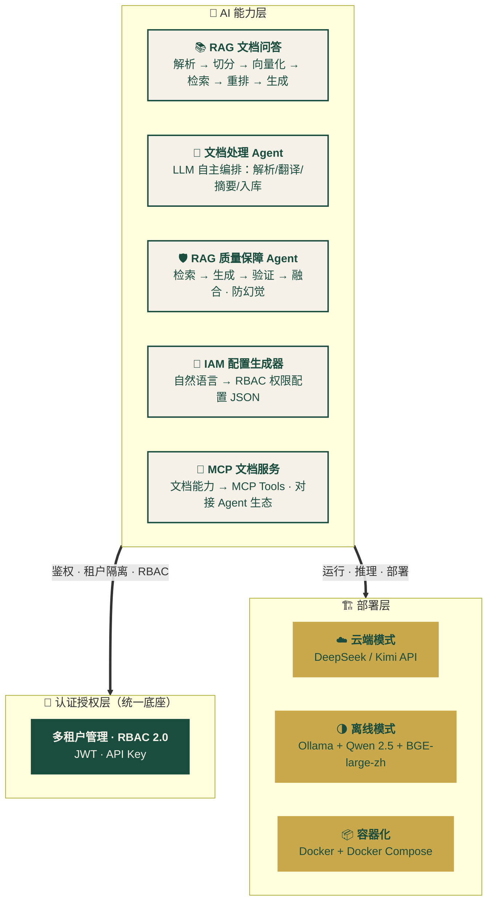

<div align="center">


# 🌿 Oasis Curator · 绿洲馆长

### *Knowledge Preserved, Context Curated, Wisdom Guided*
**知识有归，脉络可循，疑问可解**

[](./LICENSE)
[](https://www.python.org/)
[](https://vuejs.org/)
[](https://pnpm.io/)
[](./CONTRIBUTING.md)

*在信息的绿洲里，做一位递钥匙的馆长。*

[快速开始](#-快速开始) · [品牌故事](#-品牌故事) · [核心能力](#-核心能力) · [技术架构](#-技术架构) · [路线图](#-路线图) · [品牌视觉](./brand/README.md)

</div>

---

## 🌿 品牌故事

> *在《头号玩家》的绿洲世界里，博物馆的管理员奥格登·莫罗以"馆长"（The Curator）的身份守护着哈利迪的全部记忆。他不争、不抢、不炫耀权限，却总在关键时刻递上那把最对的钥匙。*

**Oasis Curator** 由此诞生 —— 它不是搜索引擎，不是问答机器人，而是一位真正意义上的**数字馆长**：

| 角色 | 使命 | 对应能力 |
|------|------|----------|
| 🏛️ **守护者** | 让每一条信息有源可溯、有权限可守 | 多租户隔离 + RBAC 权限 + 引用溯源 |
| 📚 **策展人** | 让碎片化的文档链接成有逻辑的脉络 | 智能切分 + 向量索引 + 多 Agent 验证 |
| 🗝️ **引路者** | 让模糊的问题在对话中走向清晰 | 流式问答 + 置信度分级 + 可点击引用 |


> **愿景：让每一份知识，都能被恰到好处地找到。**
---

## 💡 设计哲学

> *最好的知识工具，不是帮你翻遍所有书，而是替你选出最该读的那一本。*

Oasis Curator 的存在，是为了**让用户少翻几页、少点几次链接、少走几步弯路**。
它不追求炫技，而是追求在每一次交互中，递上**最对的那把钥匙**。

---

## ✨ 核心能力

### 🏛️ Knowledge Preserved — 知识有归

- 📄 **多格式文档入库**：PDF、Word、Markdown、TXT 一键上传，自动解析切分
- 🔒 **多租户物理隔离**：每个租户独立向量 Collection，API 层 + 存储层双重防护
- 🛡️ **细粒度权限控制**：文档可见性三级管理（租户公开 / 仅本人 / 指定角色）
- 🔑 **统一认证授权**：JWT + RBAC 2.0，支持多端登录与 API Key 管理

### 📚 Context Curated — 脉络可循

- 🧩 **智能文档切分**：按段落 + 字符滑窗，保留语义边界
- 🔍 **语义检索 + 重排序**：Embedding 召回 Top-K，LLM 重排序取 Top-N
- 🤖 **文档处理 Agent**：上传混合文档（中英/含表格），LLM 自主编排解析/翻译/摘要/入库
- 🧠 **多 Agent 质量保障**：检索 → 生成 → 验证 → 融合，逐句防幻觉，置信度分级输出

### 🗝️ Wisdom Guided — 疑问可解

- 💬 **流式对话问答**：逐字输出，引用溯源可点击跳转
- 🎯 **自然语言配权**：IAM 配置生成器，自然语言 → RBAC 权限配置 JSON
- 🔌 **MCP 标准化接入**：将文档检索和问答能力暴露为 MCP 工具，对接 Agent 生态
- 🌗 **双模式部署**：云端（DeepSeek/Kimi）+ 离线（Ollama + Qwen + BGE）

---

## 🏗️ 技术架构



**技术栈速览：**

| 类别 | 技术选型 |
|------|----------|
| 前端 | Vue 3 · TypeScript · Element Plus · Pinia · pnpm |
| 后端 | Python 3.11+ · FastAPI · Pydantic · SQLAlchemy |
| AI 编排 | LangChain · LangGraph · Function Calling |
| 向量库 | Milvus Lite · ChromaDB |
| LLM | DeepSeek · Kimi · Qwen 2.5（离线） |
| Embedding | 智谱 Embedding · BGE-large-zh（离线） |
| 协议 | MCP (Model Context Protocol) |
| 部署 | Docker · Docker Compose · SQLite/PostgreSQL |

---

## 🚀 快速开始

### 前置依赖

- Docker 20.10+ & Docker Compose v2+
- Node.js 18+ & pnpm 8+（前端开发）
- 4 核 CPU / 8GB 内存（最低配置）
- 离线模式额外需要：50GB 磁盘（用于存储本地模型）

> 💡 **包管理器选择**：前端使用 [pnpm](https://pnpm.io/) 而非 npm/yarn，原因是其磁盘空间利用率高、依赖解析严格、安装速度快。如未安装 pnpm，可执行 `npm install -g pnpm` 或使用 `corepack enable && corepack prepare pnpm@latest --activate`。

### ☁️ 云端模式（5 分钟可用）

```bash
# 1. 克隆仓库
git clone https://github.com/wudgyu/oasis-curator.git
cd oasis-curator

# 2. 配置环境变量
cp .env.example .env
# 编辑 .env，填入 DEEPSEEK_API_KEY / KIMI_API_KEY / ZHIPU_API_KEY

# 3. 一键启动
docker compose -f docker-compose.cloud.yml up -d

# 4. 访问
open http://localhost:5173   # 前端
open http://localhost:8000/docs   # API 文档
```

### 🌗 离线模式（私有化部署）

```bash
# 1. 下载离线模型（首次约 30GB）
bash scripts/download_models.sh

# 2. 启动离线栈
DEPLOY_MODE=offline docker compose -f docker-compose.offline.yml up -d

# 3. 访问
open http://localhost:5173
```

### 🛠️ 本地开发

```bash
# 后端
cd backend
python -m venv .venv && source .venv/bin/activate
pip install -r requirements.txt
uvicorn app.main:app --reload

# 前端（使用 pnpm）
cd frontend
pnpm install
pnpm dev
```

---

## 🎬 演示场景

> *5 分钟体验馆长的全部能力*

```
🌿 场景 1：知识有归
→ 上传一份 50 页的产品手册 PDF
→ 系统自动解析 → 切分 → 向量化 → 入库（按租户隔离）
→ 提问："产品保修期是多久？" → 流式输出答案 + 引用跳转

📚 场景 2：脉络可循
→ 上传一份中英文混合、含表格的技术规范
→ 文档处理 Agent 自主决策：解析 → 提取表格 → 翻译 → 摘要 → 入库
→ 全过程可视化，可看到 Agent 思考与执行

🗝️ 场景 3：疑问可解
→ 提问一个刁钻问题，答案可能不明确
→ 多 Agent 质量保障管线启动：
   检索 → 生成 → 验证 → 融合
→ 最终输出：答案 + 置信度（高/中/低）+ 引用来源
→ 错误时低置信度拒答，不编造

🛡️ 场景 4：权限守护
→ 创建两个租户 A 和 B
→ A 上传机密文档，设为"仅本人可见"
→ B 租户的用户用相同问题提问 → 完全检索不到
→ 篡改请求中的 tenant_id → API 层 403 拒绝
```

---

## 📂 项目结构

```
oasis-curator/
├── frontend/                  # Vue 3 前端（pnpm 管理）
│   ├── src/
│   │   ├── views/
│   │   │   ├── Login.vue
│   │   │   ├── AdminPanel.vue          # 租户/用户管理
│   │   │   ├── DocUpload.vue           # 文档上传
│   │   │   ├── DocQA.vue               # 问答对话
│   │   │   ├── DocAgent.vue            # 文档处理 Agent
│   │   │   ├── IamConfigGenerator.vue  # IAM 配置生成器
│   │   │   └── McpSettings.vue         # MCP 服务配置
│   │   ├── stores/           # Pinia stores
│   │   └── api/              # Axios 封装
│   ├── .npmrc                # pnpm 配置（auto-install-peers、strict-peer-dependencies）
│   ├── package.json
│   └── pnpm-lock.yaml
│
├── backend/                   # FastAPI 后端
│   ├── app/
│   │   ├── core/             # 核心 AI 能力
│   │   │   ├── llm_provider.py         # 多模型路由
│   │   │   ├── rag_pipeline.py         # RAG 全链路
│   │   │   ├── doc_agent.py            # 文档处理 Agent
│   │   │   ├── qa_agent.py             # 质量保障 Agent
│   │   │   ├── iam_config.py           # IAM 生成器
│   │   │   └── mcp_server.py           # MCP 服务
│   │   ├── api/              # 路由模块
│   │   ├── models/           # SQLAlchemy 模型
│   │   ├── schemas/          # Pydantic 模型
│   │   └── main.py
│   └── requirements.txt
│
├── scripts/
│   └── download_models.sh    # 离线模型下载脚本
│
├── docker-compose.cloud.yml
├── docker-compose.offline.yml
├── .env.example
├── LICENSE
└── README.md
```

---

## 🗺️ 路线图

- [ ] **v0.1** · 认证授权底座（多租户 + RBAC + JWT）
- [ ] **v0.2** · LLM 多模型路由（DeepSeek / Kimi / Ark）
- [ ] **v0.3** · IAM 配置生成器（自然语言 → 权限配置）
- [ ] **v0.4** · RAG 文档问答（多租户隔离 + 引用溯源）
- [ ] **v0.5** · 文档处理 Agent（Function Calling 自主编排）
- [ ] **v0.6** · 多 Agent 质量保障（LangGraph 防幻觉）
- [ ] **v0.7** · MCP 文档服务（标准化工具接入）
- [ ] **v1.0** · 双模式部署（云端 + 离线）+ 完整文档

---

## 🤝 贡献指南

欢迎任何形式的贡献：

- 🐛 **Bug 反馈**：在 Issues 中描述问题与复现步骤
- 🔧 **代码贡献**：Fork → 分支开发 → 提交 PR
- 📖 **文档改进**：翻译、补全、纠错都欢迎
- 🎨 **品牌素材**：Logo 优化、配色方案、新增应用场景

详见 [`CONTRIBUTING.md`](./CONTRIBUTING.md)。

---

## 📄 开源协议

本项目采用 [MIT License](./LICENSE) 开源。

---

<div align="center">

**🌿 守护知识，激活智慧 🌿**

[回到顶部](#-oasis-curator--绿洲馆长)

</div>
