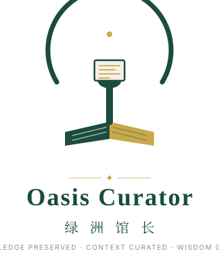

# 🎨 Oasis Curator 品牌视觉系统

> 完整 Logo 文件、应用场景规范、字体说明见本目录。
> 本文档是 Oasis Curator 项目的**品牌 VI 手册**——所有视觉规范的唯一权威来源。

---

## 速览

### 品牌主张

> *Knowledge Preserved, Context Curated, Wisdom Guided*
> **知识有归，脉络可循，疑问可解**

### Logo 预览

|  |  |
|:---:|:---:|
| 主 Logo（首选） | 横排版（用于网站头部、文档） |
|  |  |
| 竖排完整版（名片、海报） | 简化图标（App Icon、缩略图） |

### 视觉元素

| 元素 | 象征 | 对应理念 |
|------|------|----------|
| 📖 书/典籍 | 知识库 | Knowledge Preserved |
| ✋ 手托书页 | 馆长的"策展"与"引导" | Context Curated / Wisdom Guided |
| ⭕ 半开放圆环 | 绿洲世界的入口 + 守护的边界 | 开放但不失边界 |
| 🚪 圆环断开处 | 留一道门，等人来问 | 主动引导而非封闭 |
| ✦ 顶部金点 | 智慧之光 / 入口处的召唤 | Wisdom Guided |

### 品牌色速览

| 主色 | 辅色 | 背景 |
|------|------|------|
| 🟢 墨绿 `#1A4D3E` | 🟡 暖金 `#C9A84C` | 🟤 象牙白 `#F5F0E8` |
| Logo、标题、强调 | 焦点、按钮、引用 | 页面背景 |

> 完整配色（含辅助色、对比度、CSS 变量）见 [四、色彩体系](#四色彩体系)。
>
> Logo 文件清单与使用规范见 [二、Logo 文件清单](#二logo-文件清单) 与 [三、Logo 使用规范](#三logo-使用规范)。

---

## 一、Logo 概念

> **「翻开典籍的守护者」** —— 一本微微敞开的书/典籍，书脊处延伸出一只简化的人手轮廓，手指轻托书页边缘。手的形态介于"托举"与"翻阅"之间。整体被一个半开放的圆环包裹，圆环在顶部断开，形成"门"的意象。

### 元素拆解

| 元素 | 象征 | 对应理念 |
|------|------|----------|
| 📖 书/典籍 | 知识库 | Knowledge Preserved |
| ✋ 手托书页 | 馆长的"策展"与"引导" | Context Curated / Wisdom Guided |
| ⭕ 半开放圆环 | 绿洲世界的入口 + 守护的边界 | 开放但不失边界 |
| 🚪 圆环断开处 | 留一道门，等人来问 | 主动引导而非封闭 |
| ✦ 顶部金点 | 智慧之光 / 提示与引导 | 入口处的召唤 |

---

## 二、Logo 文件清单

> 所有源文件位于 `logo/` 目录，**优先使用 SVG**（无损、可缩放、文件小）。

| 文件 | 用途 | 尺寸建议 |
|------|------|----------|
| `logo/logo-primary.svg` | **主 Logo**，默认选择 | ≥ 64px |
| `logo/logo-horizontal.svg` | 横排版（Logo + 文字），用于网站头部 | ≥ 200px 宽 |
| `logo/logo-vertical.svg` | 竖排完整版（Logo + 中英 + Slogan），用于名片/封面 | ≥ 160px 宽 |
| `logo/logo-mono.svg` | 单色版（仅墨绿），用于单色印刷/压印/雕刻 | 任何尺寸 |
| `logo/logo-icon.svg` | 简化图标，用于 App Icon / 中等场景 | 32-256px |
| `logo/favicon.svg` | 浏览器标签图标，矢量 favicon | 16-32px |
| `logo/oasis-curator-256.png` | PNG 备用（README 引用） | 256×256 |

### PNG 备用

如需 PNG（README 中 GitHub 不直接渲染 SVG 缩略图），运行：

```bash
pip install cairosvg
python scripts/render_logos.py
```

将自动生成 64/128/256/512/1024 五种尺寸。

---

## 三、Logo 使用规范

### ✅ 允许的使用

- 在深色或浅色背景上使用完整彩色版
- 在单色印刷场景使用 `logo-mono.svg`
- 按比例缩放（保持长宽比）
- 周围保留足够的"安全空间"（见下）

### ❌ 禁止的使用

- 改变 Logo 的长宽比
- 重新着色（除非使用单色版）
- 添加阴影、发光、3D 效果
- 旋转 Logo（保持缺口在顶部）
- 在对比度不足的背景上使用（如浅绿底上用墨绿 Logo）
- 在 Logo 上叠加其他文字或图形

### 安全空间

Logo 周围至少保留 **1× Logo 高度** 的空白区域。

```
  ┌─────────────────────┐
  │                     │
  │   ┌─────────────┐   │  ← 1× 高度的安全空间
  │   │             │   │
  │   │   [ LOGO ]  │   │
  │   │             │   │
  │   └─────────────┘   │
  │                     │
  └─────────────────────┘
```

### 最小尺寸

| 场景 | 最小尺寸（高度） |
|------|------------------|
| 主 Logo | 32px |
| 横排版 | 120px 宽 |
| Icon | 16px |
| Favicon | 16px（推荐 32px 以保证清晰） |

---

## 四、色彩体系

### 主色

| 色名 | 色值 | RGB | 用途 |
|------|------|-----|------|
| 🟢 绿洲墨绿 | `#1A4D3E` | 26, 77, 62 | Logo、标题、强调色 |
| 🟡 典藏暖金 | `#C9A84C` | 201, 168, 76 | 焦点、按钮、引用标注 |
| 🟤 书页象牙 | `#F5F0E8` | 245, 240, 232 | 背景色 |

### 辅助色

| 色名 | 色值 | 用途 |
|------|------|------|
| ⚫ 深灰 | `#2C2C2C` | 正文 |
| ⚪ 浅灰 | `#8C8C8C` | 辅助信息、Slogan |
| 🟢 薄荷点缀 | `#7AB8A0` | 成功状态 |
| 🟠 暖橙警告 | `#D4884C` | 警告状态 |
| 🔴 朱砂错误 | `#A8443C` | 错误状态 |

### CSS 变量

```css
:root {
  --oasis-green: #1A4D3E;
  --oasis-gold: #C9A84C;
  --oasis-ivory: #F5F0E8;
  --oasis-text: #2C2C2C;
  --oasis-muted: #8C8C8C;
  --oasis-mint: #7AB8A0;
  --oasis-warn: #D4884C;
  --oasis-error: #A8443C;
}
```

### 对比度检查

| 组合 | 对比度 | 适用 |
|------|--------|------|
| 墨绿 on 象牙白 | 9.4:1 | 正文 ✓ |
| 暖金 on 墨绿 | 4.6:1 | 强调 ✓ |
| 深灰 on 象牙白 | 11.2:1 | 正文 ✓ |
| 浅灰 on 象牙白 | 3.1:1 | 仅辅助信息 |

均通过 WCAG AA 标准（正文 ≥ 4.5:1，辅助 ≥ 3:1）。

---

## 五、字体体系

| 用途 | 中文 | 英文 |
|------|------|------|
| 标题 | 思源宋体 (Source Han Serif) | Playfair Display |
| 正文 | 思源黑体 (Source Han Sans) | Inter |
| 代码 | JetBrains Mono | JetBrains Mono |

### Web 引入

```html
<!-- Google Fonts -->
<link rel="preconnect" href="https://fonts.googleapis.com">
<link rel="preconnect" href="https://fonts.gstatic.com" crossorigin>
<link href="https://fonts.googleapis.com/css2?family=Playfair+Display:wght@600;700&family=Inter:wght@400;500;600&display=swap" rel="stylesheet">
```

```css
.title { font-family: 'Playfair Display', 'Source Han Serif SC', serif; }
.body  { font-family: 'Inter', 'Source Han Sans SC', sans-serif; }
.code  { font-family: 'JetBrains Mono', 'Cascadia Code', monospace; }
```

---

## 六、应用场景示例

### Web 界面
- 顶部导航：墨绿 Logo + 象牙白背景
- 主按钮：暖金底 + 象牙白文字
- 引用标注：暖金下划线，可点击

### 文档 / PPT
- 封面：墨绿底 + 象牙白 Logo（使用 `logo-mono.svg` 反色版本）
- 章节标题：墨绿色 + 宋体
- 强调内容：暖金下划线或色块

### 名片 / 工牌
- 正面：`logo-vertical.svg`
- 背面：Slogan + 联系方式

---

## 七、Logo 演变记录

| 版本 | 日期 | 变化 |
|------|------|------|
| v1.0 | 2026-08 | 初始设计：半开放圆环 + 典籍 + 托书之手 + 暖金页面 |

---

> *守护知识，激活智慧。*
> *Oasis Curator · 2026*
